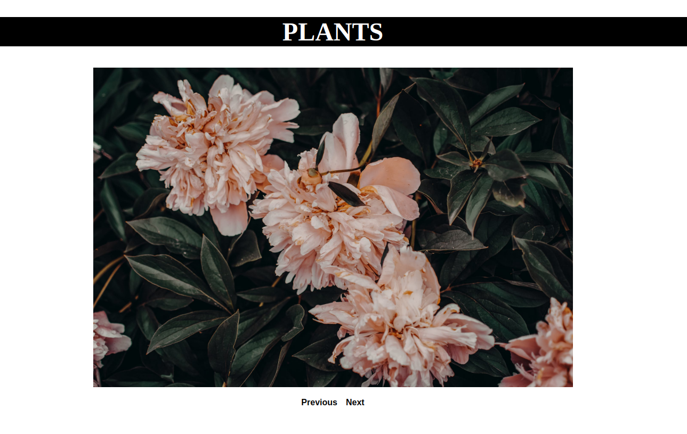

# Carousel Image Gallery
Build a simple amage Carousel with a previous and next button

**Link to project:** https://amazing-jones-da0129.netlify.com

## How It's Made:

**Tech used:** HTML5, CSS3, JavaScript.
Styling for this project was done using a CSS Grid layout. Behaviour of moving thorugh images was made by iterating through an array of image url's to replace the src attribute in an image tag.

## Optimizations
Iteration of the image src and only using one image tag made the code more dry.

## Lessons Learned:
Solved how to repeat the array when we got to the end or start of the array.

## Examples:

**To-do List:** https://github.com/Eriquette/todo-list-2018c-week05/tree/answer

**Daily Code Challenges:** https://github.com/Eriquette/Daily-Code-Challenges

**OOP Calculator:** https://github.com/Eriquette/week01-alumni-project-calculator/tree/answer
